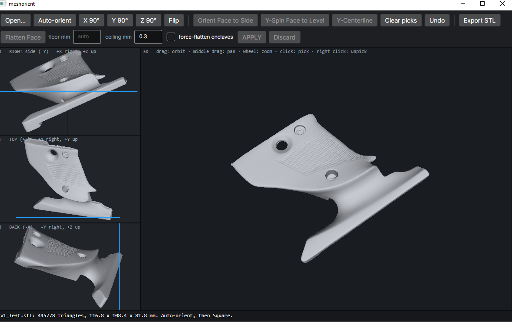
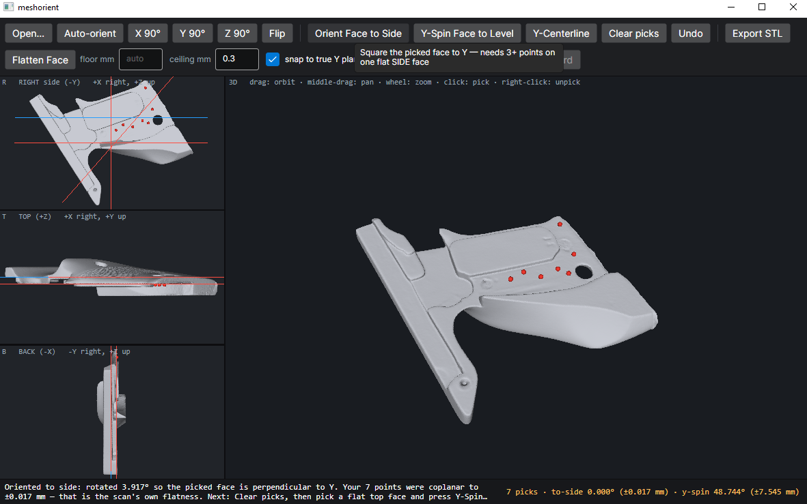
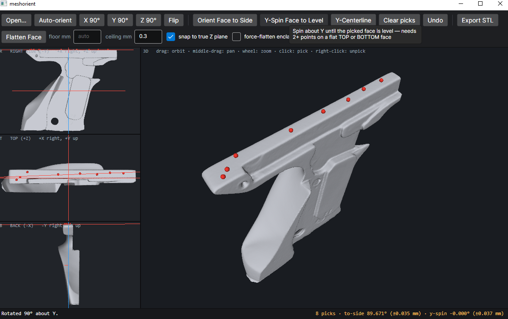
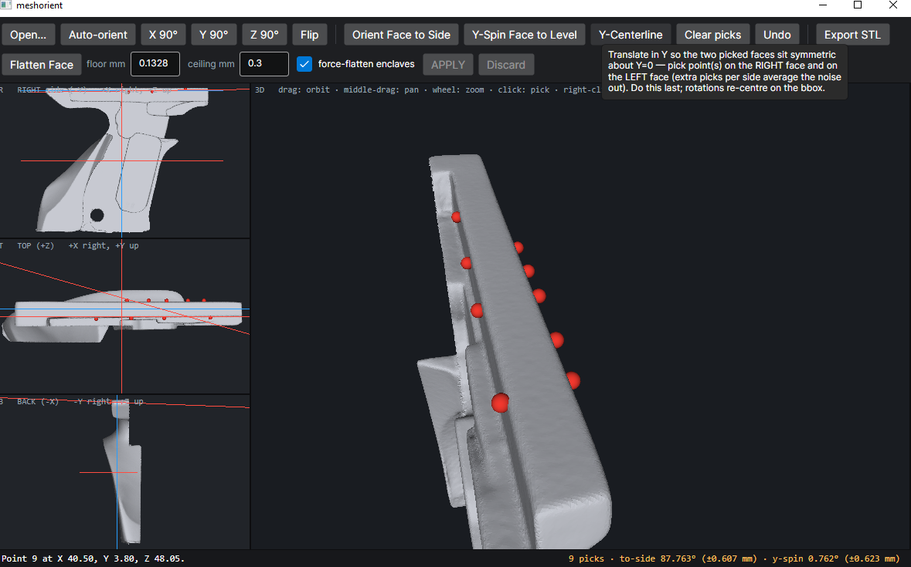
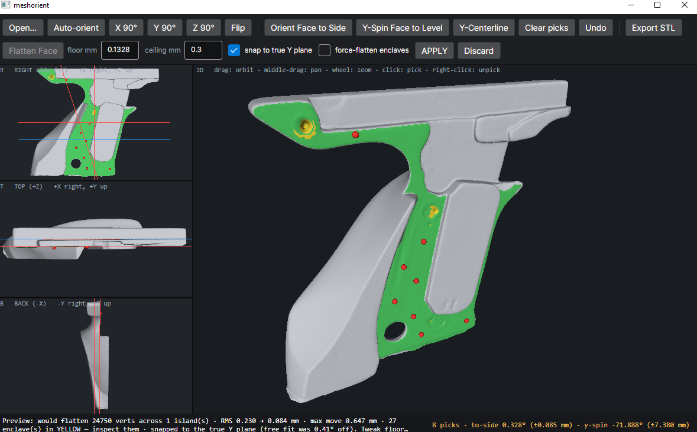
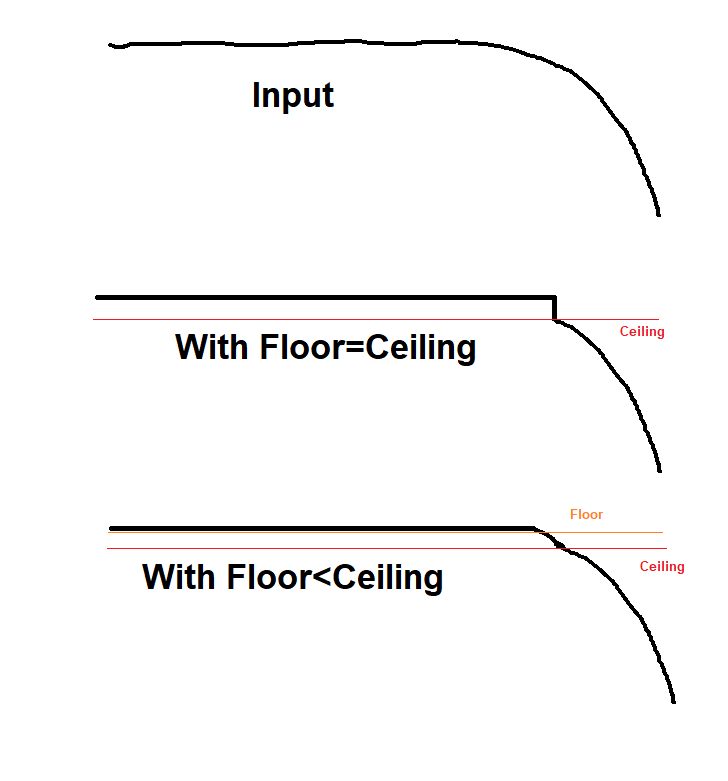

# meshorient

Small tool I shamelessly slopcoded for processing 3d scans before I work on them in Blender or other programs.

This is my workflow for getting a scan STL rotated to axis alignment and slightly cleaned up. Nothing here is
particularly novel, but I find this tool fast and convenient. It does the specific things I needed. It is my default
file association for .stl files since it's also a serviceable viewer app.

## Features

* Align selected face to the XZ plane
* Spin to align another selected face to the X-axis
* Center the model between two chosen opposite faces
* Flatten near-flat faces, removing scan noise and optionally snapping to true world-plane alignment

## Usage

First, open an STL. If it's fresh off a 3d scan it will probably come in with some random arbitrary orientation.

### Orienting

Next, find a big flat face you think should rightly be considered on the "side" of the object. Click a bunch of points
on it to place red dots. The more points you use the better the result will average-out scan noise, so I usually click
like 7 or 8 spots and try to spread them out over the face and avoid intentionally putting one in a dimple or lump.

If you misplace a dot, right-clicking will remove it.

Use the "Orient Face to Side" button to spin the model around making that face parallel to the XZ plane.

At this point the model is still slightly woppyjaw, as the "Right Side" panel shows. To resolve this, we want to spin it
around the Y-axis only, not altering our previously selected XZ-plane paralellism.

Hit "Clear picks" to remove your existing red dots. Now make a new selection on a plane that you feel represents the
"top" or "bottom" of your model. Again, try to spread out your dots so the tool can average these points out to
ignore noise.

### Spinning

Use the "Y-Spin Face to Level" button to spin the model so this plane is on top/bottom. This will not alter the previous
plane-orientation, it only rotates around the Y-axis.

If it comes through "upside down" from what you intended, just use the Y-90\* button a couple times to flip it over.

### Centerline

The example file I'm using in these screenshots isn't really a use case for this, but sometimes I get a file where I
care about centering it left-to-right along the Y-axis.

To do that, clear picks again, and make new picks this time placing your picks on *two* different faces. These should be
faces with clearly different Y-axis values!

Then click "Y-Centerline" and the model will be shifted over so that those two faces are symmetric about the centerline,
i.e. one face is at Y=k and the other is at Y=-k.

Obviously, this feature only makes sense to use *after* the model has been oriented using the previously mentioned
tools. It will not alter the rotation, it will only slide it along the Y-axis. Think Blender "G-Y" keyboard command.

### Export

The "Export STL" button will write "x_oriented.stl" where *x* is whatever filename you have open. Meshorient never
overwrites the original opened file. It *will* however eagerly clobber x_oriented.stl if it already exists, so be aware of that.

### Flattening

Using the same basic approach of placing red dots, you can identify any approximately-flat plane on the model and use "Flatten Face" to smush it down to true flat.

The green preview shows the area that will be affected, and the "APPLY" button makes it take effect.

Note that flattening is special because it actually modifies the model, it doesn't just rotate and translate it. For
this reason, if you've applied any "flatten" operations, "Export STL" will generate **two** files. It will export both
"x_oriented.stl" and "x_cleaned.stl". The _cleaned file has all your edits, including flattening, the _oriented version
*only* has the rotations and translations, so you can keep the original scan in full fidelity just more conveniently rotated.

### Understanding the Flattening Tool

This tool "flood fills" outward from your selected dots to find the affected verts. Unlike the select->coplanar tool in
Blender, it doesn't jump across gaps and pull in faces from unconnected areas of the model.

Applying purely moves the vertices to snap them to the inferred average plane of your selection. It doesn't simplify the
topology and the triangle count doesn't change. You'll need to use Blender's decimate or another tool for that if that's
what you want. For my purposes (printing and CAD/CAM) I usually do not need to worry about simplifying polycount.

#### Floor and Ceiling

The "ceiling mm" parameter is the max distance from the intended plane a vert can be before it's considered no longer in
plane. Think of this as the tolerance of the flood fill.

The "floor mm" parameter is a little more complex. Any vert that is *below* floor mm will get fully, 100% snapped to the
intended plane when you apply the flattening. But verts that are *between* floor and ceiling will get an attenuated
snap.

This is important when you have a flat plane that runs to a gentle curved slope. It preserves some smoothness to the
transition, whereas if you use the same value for floor and ceiling, there'll be a jagged, raised edge created where the
snap-to-plane pulled up (or down) some of the verts from the start of the slope, then suddenly stopped.

"floor mm" gets auto-populated for your selection based on the typical deviation found within the green area.
This is what the program infers is the size of ordinary scan noise found within a flat plane.

#### Enclaves

The green highlight shows the faces that will be affected. Yellow highlights are "enclaves", parts of the topology that are
fully *surrounded* by flood-filled areas, but are too far out-of-plane (in excess of ceiling mm) to be included.

If you check the box "force-flatten enclaves" it'll bring those in too, utterly ignoring the fact that they are NOT
really coplanar and may be hugely deviant from the plane. It will force them to get a full-value plane snap not even
attenuated by floor-ceiling distance. Attenuation in this case would only leave lumpy defects behind in the middle of
flat surfaces. This option is occasionally useful for deleting an undesired feature that left a lump/bump in the scan
data on a plane.

#### Snap to true plane

If the plane formed to fit the chosen points is within a couple degrees of the true X, Y, or Z normal, you will also
have the option to "snap to true plane". This is likely to happen if you followed the orientation steps before doing any
flattening.

This makes the flatten tool create surfaces that are normal to the world axis. In most cases this is desirable so
this is checked by default. Having a large flat surface on the model be *almost-but-not-quite-exactly* parallel to a
world plane can be frustrating if you're later trying to use it as a reference for CAD or do CSG with other models, and
this feature allows you to avoid that pain.

